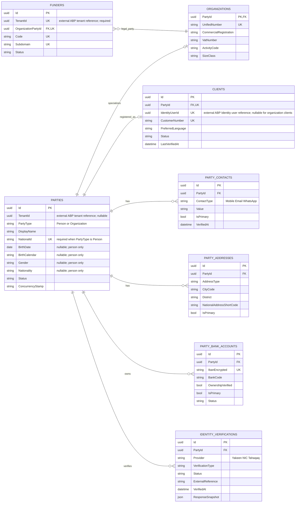
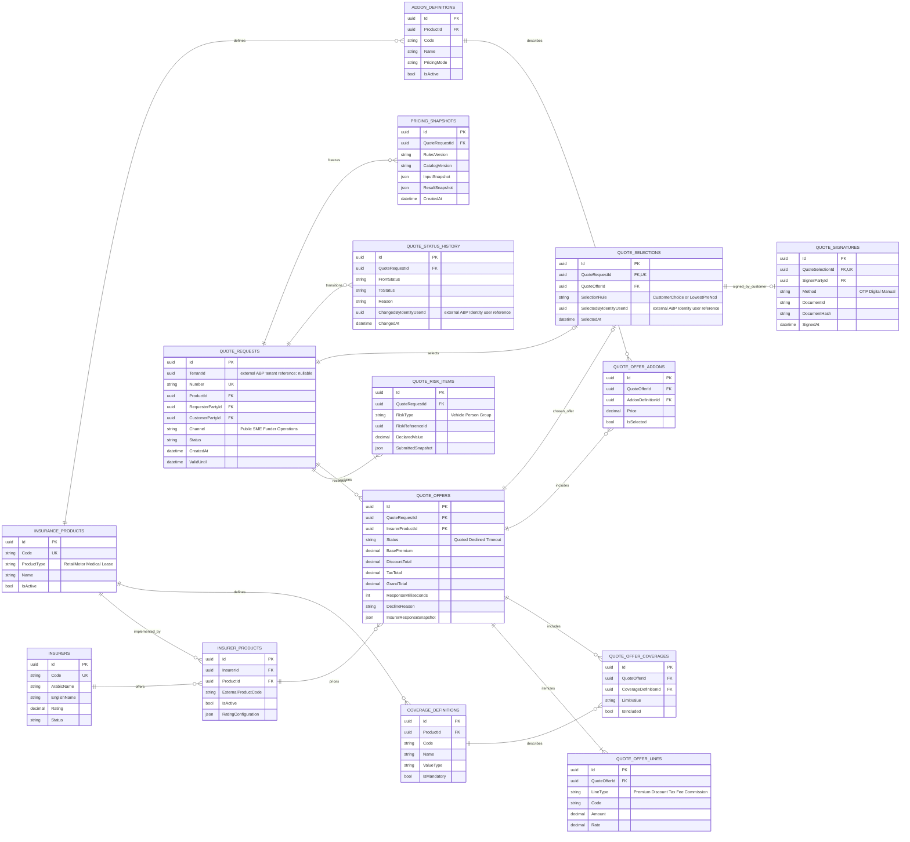
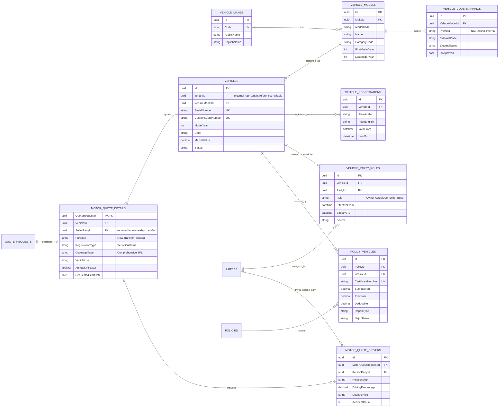
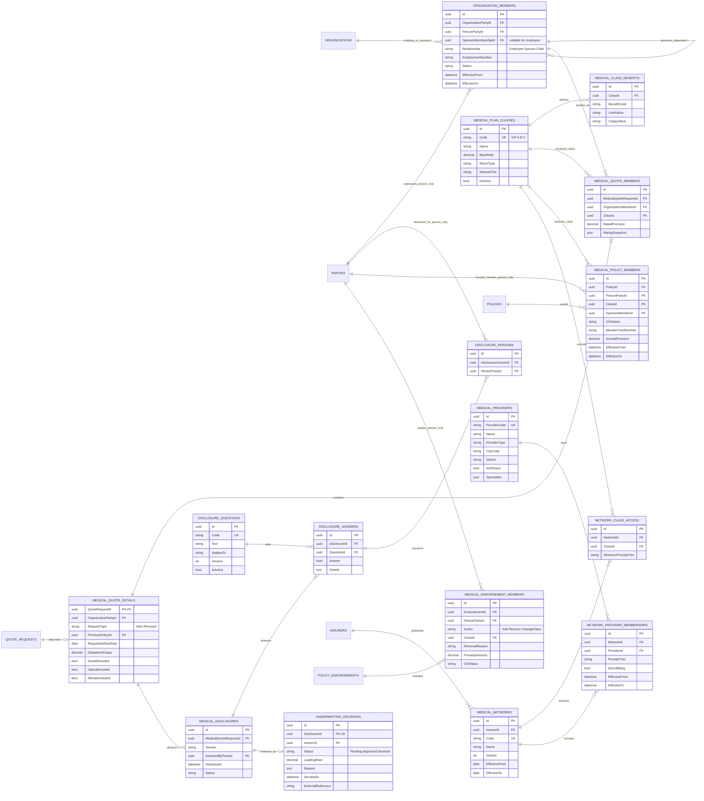
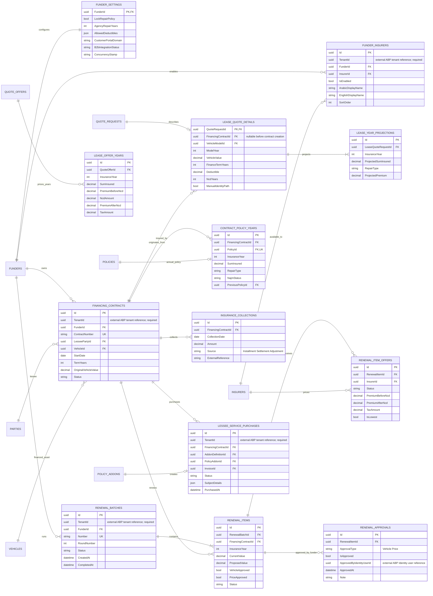
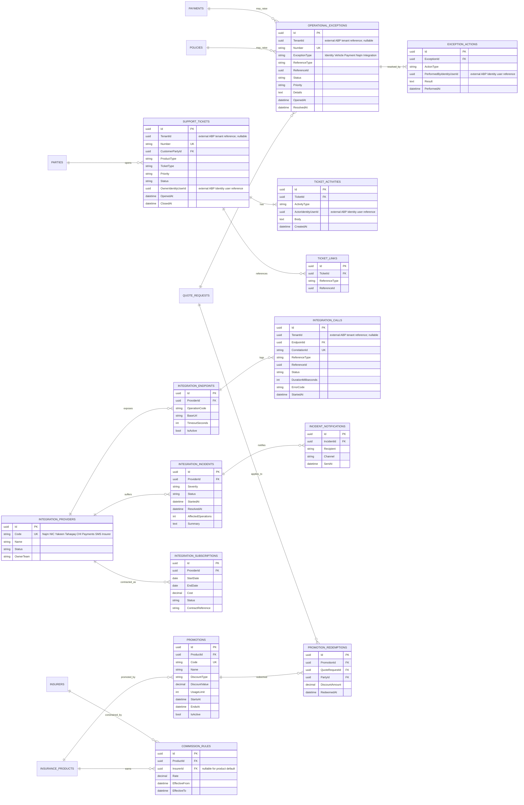

# Thiqatak business ERD for ABP.IO

This model was reverse-engineered from `index.html` and `FunderPortal.html`. The two files contain the same business prototype; `FunderPortal.html` starts directly in the funder portal, while `index.html` exposes the public, customer, funder, lessee, and Thiqatak operations views.

The model deliberately represents business state, auditability, and integrations rather than HTML screens. It is split into bounded contexts because a single physical ERD with all tables would be unreadable.

## Core decisions

- Every funder is associated one-to-one with an ABP tenant through `Funder.TenantId` (unique and required), but ABP tables are intentionally outside this business ERD.
- Funder users, financed-vehicle quotes, contracts, policies, renewals, and funder configuration are tenant-owned and implement `IMultiTenant`.
- Insurers, insurance products, vehicle reference data, medical provider reference data, and integration-provider definitions are host-owned shared records.
- Retail customers and SME organizations are parties/business accounts, not ABP tenants. Their rows normally have `TenantId = null`.
- A person or organization is represented once as a `Party`; product-specific aggregates reference that party instead of duplicating identity, contact, address, or bank data.
- Quotes and issued policies store immutable pricing and business snapshots. Later catalog or pricing-rule changes must not rewrite historical offers.
- ABP Identity, roles, permissions, security logs, tenant management, settings, features, audit logging, and blob storage should be reused instead of rebuilt or represented as Thiqatak business entities.
- Application notifications use ABP/infrastructure services and are not modeled as business entities.
- Consent checkboxes remain part of the UI flow, but consent persistence is outside the current scope and has no dedicated business entity for now.
- Organization users, roles, and permissions are managed by ABP Identity. `OrganizationPartyId` is stored as an ABP user extra property or claim. One user belongs to one business organization in the current scope.
- `IdentityUserId` denotes a reference to an external ABP Identity user. `TenantId` denotes a reference to an external ABP tenant and appears only on business entities that can be tenant-owned.

## 1. Identity integration, tenant references, and parties

## 2. Product catalog and quote lifecycle

## 3. Policies, billing, documents, and claims

```mermaid
erDiagram
    direction LR
    QUOTE_SELECTIONS ||--o| POLICIES : issues
    INSURERS ||--o{ POLICIES : underwrites
    POLICIES ||--|{ POLICY_PARTIES : assigns_roles
    PARTIES ||--o{ POLICY_PARTIES : participates
    POLICIES ||--o{ POLICY_ASSETS : covers
    POLICIES ||--o{ POLICY_COVERAGES : contains
    POLICIES ||--o{ POLICY_ADDONS : contains
    POLICIES ||--o{ POLICY_DOCUMENTS : produces
    POLICIES ||--o{ POLICY_STATUS_HISTORY : transitions
    POLICIES ||--o{ POLICY_ENDORSEMENTS : amended_by
    POLICY_ENDORSEMENTS ||--o{ ENDORSEMENT_LINES : itemizes
    POLICIES ||--o{ INVOICES : billed_by
    INVOICES ||--|{ INVOICE_LINES : itemizes
    INVOICES ||--o{ INSTALLMENTS : schedules
    INVOICES }o--o{ PAYMENTS : settled_by
    PAYMENTS ||--o{ PAYMENT_ATTEMPTS : attempts
    INVOICES ||--o{ CREDIT_NOTES : credits
    PAYMENTS ||--o{ REFUNDS : refunds
    POLICIES ||--o{ CLAIMS : receives
    CLAIMS ||--o{ CLAIM_DOCUMENTS : has
    CLAIMS ||--|{ CLAIM_STATUS_HISTORY : transitions

    POLICIES {
        uuid Id PK
        uuid TenantId "external ABP tenant reference; nullable"
        string PolicyNumber UK
        uuid ProductId FK
        uuid InsurerId FK
        uuid QuoteSelectionId FK
        string Status
        date EffectiveFrom
        date EffectiveTo
        decimal Subtotal
        decimal TaxAmount
        decimal TotalAmount
        string Currency
    }
    POLICY_PARTIES {
        uuid Id PK
        uuid PolicyId FK
        uuid PartyId FK
        string Role "Holder Owner Insured Lessee Beneficiary Driver Member"
        datetime EffectiveFrom
        datetime EffectiveTo
    }
    POLICY_ASSETS {
        uuid Id PK
        uuid PolicyId FK
        string AssetType "Vehicle MedicalGroup"
        uuid AssetReferenceId
        decimal SumInsured
        string Status
    }
    POLICY_COVERAGES {
        uuid Id PK
        uuid PolicyId FK
        uuid CoverageDefinitionId FK
        decimal Premium
        string LimitValue
        string DeductibleValue
    }
    POLICY_ADDONS {
        uuid Id PK
        uuid PolicyId FK
        uuid AddonDefinitionId FK
        uuid EndorsementId FK "nullable"
        decimal Premium
        datetime EffectiveFrom
        datetime EffectiveTo
        string Status
    }
    POLICY_DOCUMENTS {
        uuid Id PK
        uuid PolicyId FK
        string DocumentType "Policy Certificate Terms Benefits Receipt"
        string BlobName
        string ExternalDocumentId
        string Sha256
        datetime GeneratedAt
    }
    POLICY_STATUS_HISTORY {
        uuid Id PK
        uuid PolicyId FK
        string FromStatus
        string ToStatus
        string Reason
        datetime ChangedAt
    }
    POLICY_ENDORSEMENTS {
        uuid Id PK
        uuid TenantId "external ABP tenant reference; nullable"
        uuid PolicyId FK
        string Number UK
        string EndorsementType
        date EffectiveDate
        string Status
        decimal NetAmount
    }
    ENDORSEMENT_LINES {
        uuid Id PK
        uuid EndorsementId FK
        string ActionType
        string SubjectType
        uuid SubjectReferenceId
        decimal Amount
        json ChangeSnapshot
    }
    INVOICES {
        uuid Id PK
        uuid TenantId "external ABP tenant reference; nullable"
        string InvoiceNumber UK
        uuid PolicyId FK "nullable before issuance"
        uuid BillToPartyId FK
        string Status
        decimal Subtotal
        decimal TaxAmount
        decimal TotalAmount
        datetime IssuedAt
        datetime DueAt
    }
    INVOICE_LINES {
        uuid Id PK
        uuid InvoiceId FK
        string LineType
        string Description
        decimal Quantity
        decimal UnitPrice
        decimal TaxRate
        decimal Total
    }
    PAYMENTS {
        uuid Id PK
        uuid TenantId "external ABP tenant reference; nullable"
        string PaymentReference UK
        uuid PayerPartyId FK
        string Method "Mada Card ApplePay Sadad Bank Tabby Tamara Credit"
        string Status
        decimal Amount
        datetime PaidAt
        string ProviderReference UK
    }
    PAYMENT_ATTEMPTS {
        uuid Id PK
        uuid PaymentId FK
        int AttemptNumber
        string Status
        string FailureCode
        string IdempotencyKey UK
        datetime AttemptedAt
        json ProviderResponse
    }
    INSTALLMENTS {
        uuid Id PK
        uuid InvoiceId FK
        int Sequence
        date DueDate
        decimal Amount
        string Status
    }
    CREDIT_NOTES {
        uuid Id PK
        uuid InvoiceId FK
        string Number UK
        decimal Amount
        string Reason
        datetime IssuedAt
    }
    REFUNDS {
        uuid Id PK
        uuid PaymentId FK
        uuid BankAccountId FK "nullable"
        decimal Amount
        string Status
        string ProviderReference
        datetime RequestedAt
    }
    CLAIMS {
        uuid Id PK
        uuid TenantId "external ABP tenant reference; nullable"
        string ClaimNumber UK
        uuid PolicyId FK
        uuid ClaimantPartyId FK
        uuid PolicyAssetId FK
        string ClaimType
        datetime IncidentAt
        string NajmOrTrafficReference
        string Status
        text Description
    }
    CLAIM_DOCUMENTS {
        uuid Id PK
        uuid ClaimId FK
        string DocumentType
        string BlobName
        bool IsRequired
        datetime UploadedAt
    }
    CLAIM_STATUS_HISTORY {
        uuid Id PK
        uuid ClaimId FK
        string FromStatus
        string ToStatus
        string Note
        datetime ChangedAt
        uuid ChangedByIdentityUserId "external ABP Identity user reference"
    }
```

## 4. Retail motor insurance

## 5. SME medical insurance

## 6. Funder tenant and financed-vehicle insurance

## 7. Operations, integrations, support, and commercial rules

## Aggregate boundaries recommended for ABP

| Aggregate root | Owned children | Important invariant |
|---|---|---|
| `Funder` | `FunderSettings`, `FunderInsurer` | One funder per tenant; enabled insurers are tenant-specific. |
| `Party` | contacts, addresses, bank accounts, consents | National/unified identifiers are unique within the applicable business scope; sensitive values are encrypted. |
| `QuoteRequest` | risk items, consents, offers, offer lines, selection, signature, status history, pricing snapshots | Once an offer is received, its commercial values are immutable. Selection references exactly one successful offer. |
| `Policy` | parties, assets, coverages, add-ons, documents, status history | Issuance requires a selected valid offer and successful/authorized payment path. Historical policy terms never change in place. |
| `PolicyEndorsement` | endorsement lines and product-specific member/service changes | An endorsement is applied atomically and creates its invoice or credit note. |
| `Invoice` | invoice lines and installments | Totals equal lines plus tax; issued invoices are not edited, only credited. |
| `Payment` | payment attempts | Provider callbacks are idempotent by provider reference and idempotency key. |
| `Claim` | documents and status history | Status changes are append-only and required documents are tracked explicitly. |
| `MedicalDisclosure` | answers and affected persons | Question/version snapshots are frozen when declared; underwriting always refers to that version. |
| `RenewalBatch` | items, item offers, approvals | Vehicle approval precedes pricing; price approval precedes bulk purchase. |
| `SupportTicket` | activities and linked references | Every escalation and reassignment is retained. |
| `OperationalException` | resolution actions | Resolution is explicit; it never silently mutates the original quote or policy. |

## Business rules captured from the prototypes

1. Retail motor quotes support new insurance and ownership transfer. Transfer requires current owner/seller identity, buyer identity, and the vehicle serial number; the buyer becomes the policyholder.
2. Retail motor offers can be comprehensive or third-party, include deductibles and add-ons, and remain valid for ten hours in the prototype.
3. Financed-vehicle quotes are tenant-scoped. Only insurers enabled for that funder may quote.
4. A funder quote must select the lowest premium before the no-claims discount. Other offers remain stored for reporting but cannot be selected by sales users.
5. Funder quote letters remain valid for 60 days, require customer signature, and include a 15% annual decline in projected sum insured.
6. A financed-vehicle purchase requires quote/customer matching, contract number, serial/customs number, vehicle-code matching, and funder confirmation. A mismatch creates an operational exception.
7. Annual financed-vehicle renewals are batch based: candidate list, vehicle approval, pricing round, price approval, purchase, Najm upload, and customer notification.
8. Medical SME policies cover employees and dependants. Removing an employee also removes active dependants. Additions and removals are prorated and processed as endorsements.
9. Medical disclosure answers identify affected members and produce an insurer underwriting decision and possible premium loading.
10. Medical members have per-member class, premium, CHI upload state, and digital card data. Provider network eligibility depends on insurer network and class.
11. Policies, invoices, payments, credit notes, claims, integration calls, and audit evidence must remain queryable after business cancellation; use statuses instead of destructive deletion.

## ABP implementation notes

- Implement tenant-owned aggregate roots with `IMultiTenant`. ABP automatically applies tenant filtering and uses nullable `TenantId` for host-owned data.
- Keep `TenantId` immutable. For funder-only aggregates such as `FinancingContract` and `RenewalBatch`, require a non-null tenant in the constructor.
- Use ABP Identity users/roles/permissions for funder roles (`AccountAdmin`, `Sales`, `Operations`, `Viewer`) and Thiqatak host roles (`CustomerService`, `Operations`, `Finance`, `Compliance`, `Technical`, `OperationsManager`).
- Use an ABP Identity user extra property or claim named `OrganizationPartyId` for organization users. The current scope allows one business organization per user.
- Use ABP Organization Units only for internal hierarchy inside a funder tenant if needed; do not confuse an ABP organization unit with the business `Organization` party.
- Use ABP Blob Storing for identity evidence, quote letters, policies, certificates, invoices, claim attachments, and reports. Persist hashes and document metadata in the domain tables.
- Use ABP audit/security logs for application and authentication events, while keeping business status-history tables for domain evidence.
- Use `FullAuditedAggregateRoot<Guid>` for mutable master/configuration aggregates. Prefer audited `AggregateRoot<Guid>` plus explicit status history for financial and insurance records where soft deletion is inappropriate.
- Add `ConcurrencyStamp` to aggregates changed by several actors, especially quotes, policies, renewal batches, medical endorsements, and operational exceptions.
- Recommended precision: money `decimal(18,2)`, rates `decimal(9,6)`, sum insured `decimal(18,2)`, and timestamps in UTC.
- Encrypt national IDs, IBANs, contact destinations, and provider payloads where practical; store normalized/search hashes separately when exact lookup is required.

## Suggested ABP modules

1. `Thiqatak.Parties`
2. `Thiqatak.Catalog`
3. `Thiqatak.Quoting`
4. `Thiqatak.Policies`
5. `Thiqatak.Billing`
6. `Thiqatak.Claims`
7. `Thiqatak.Motor`
8. `Thiqatak.Medical`
9. `Thiqatak.Leasing`
10. `Thiqatak.Operations`
11. `Thiqatak.Integrations`

Start as a modular monolith with one database and separate EF Core schemas per module. The boundaries above can later become services without changing the core ownership model.

## ABP references

- [Multi-Tenancy](https://abp.io/docs/latest/framework/architecture/multi-tenancy)
- [Entities and aggregate roots](https://abp.io/docs/latest/framework/architecture/domain-driven-design/entities)
- [Identity module](https://abp.io/docs/10.6/modules/identity?LanguageCode=en)
- [Tenant Management module](https://abp.io/docs/10.6/modules/tenant-management?LanguageCode=en)

## Entity classification by insurance flow | تصنيف الكيانات حسب مسار التأمين

| التصنيف | الكيانات |
|---|---|
| كيانات مشتركة بين جميع المسارات | `PARTIES`, `CLIENTS`, `ORGANIZATIONS`, `PARTY_CONTACTS`, `PARTY_ADDRESSES`, `PARTY_BANK_ACCOUNTS`, `IDENTITY_VERIFICATIONS`, `INSURERS`, `INSURANCE_PRODUCTS`, `INSURER_PRODUCTS`, `COVERAGE_DEFINITIONS`, `ADDON_DEFINITIONS`, `QUOTE_REQUESTS`, `QUOTE_RISK_ITEMS`, `QUOTE_OFFERS`, `QUOTE_OFFER_LINES`, `QUOTE_OFFER_COVERAGES`, `QUOTE_OFFER_ADDONS`, `QUOTE_SELECTIONS`, `QUOTE_SIGNATURES`, `QUOTE_STATUS_HISTORY`, `PRICING_SNAPSHOTS`, `POLICIES`, `POLICY_PARTIES`, `POLICY_ASSETS`, `POLICY_COVERAGES`, `POLICY_ADDONS`, `POLICY_DOCUMENTS`, `POLICY_STATUS_HISTORY`, `POLICY_ENDORSEMENTS`, `ENDORSEMENT_LINES`, `INVOICES`, `INVOICE_LINES`, `PAYMENTS`, `PAYMENT_ATTEMPTS`, `INSTALLMENTS`, `CREDIT_NOTES`, `REFUNDS`, `CLAIMS`, `CLAIM_DOCUMENTS`, `CLAIM_STATUS_HISTORY` |
| تأمين المركبات | `VEHICLE_MAKES`, `VEHICLE_MODELS`, `VEHICLE_CODE_MAPPINGS`, `VEHICLES`, `VEHICLE_REGISTRATIONS`, `VEHICLE_PARTY_ROLES`, `MOTOR_QUOTE_DETAILS`, `MOTOR_QUOTE_DRIVERS`, `POLICY_VEHICLES` |
| التأمين الطبي | `ORGANIZATION_MEMBERS`, `MEDICAL_PLAN_CLASSES`, `MEDICAL_CLASS_BENEFITS`, `MEDICAL_QUOTE_DETAILS`, `MEDICAL_QUOTE_MEMBERS`, `DISCLOSURE_QUESTIONS`, `MEDICAL_DISCLOSURES`, `DISCLOSURE_ANSWERS`, `DISCLOSURE_PERSONS`, `UNDERWRITING_DECISIONS`, `MEDICAL_POLICY_MEMBERS`, `MEDICAL_PROVIDERS`, `MEDICAL_NETWORKS`, `NETWORK_CLASS_ACCESS`, `NETWORK_PROVIDER_MEMBERSHIPS`, `MEDICAL_ENDORSEMENT_MEMBERS` |
| المركبات المؤجرة | `FUNDERS`, `FUNDER_SETTINGS`, `FUNDER_INSURERS`, `FINANCING_CONTRACTS`, `LEASE_QUOTE_DETAILS`, `LEASE_YEAR_PROJECTIONS`, `LEASE_OFFER_YEARS`, `CONTRACT_POLICY_YEARS`, `INSURANCE_COLLECTIONS`, `RENEWAL_BATCHES`, `RENEWAL_ITEMS`, `RENEWAL_ITEM_OFFERS`, `RENEWAL_APPROVALS`, `LESSEE_SERVICE_PURCHASES` |
| التشغيل والتكاملات المشتركة | `OPERATIONAL_EXCEPTIONS`, `EXCEPTION_ACTIONS`, `SUPPORT_TICKETS`, `TICKET_ACTIVITIES`, `TICKET_LINKS`, `INTEGRATION_PROVIDERS`, `INTEGRATION_ENDPOINTS`, `INTEGRATION_CALLS`, `INTEGRATION_INCIDENTS`, `INCIDENT_NOTIFICATIONS`, `INTEGRATION_SUBSCRIPTIONS`, `PROMOTIONS`, `PROMOTION_REDEMPTIONS`, `COMMISSION_RULES` |

## Entity names and usage | أسماء الكيانات واستخدامها

| Entity name (English) | الاسم العربي | الاستخدام |
|---|---|---|
| `PARTIES` | الأطراف | يمثل شخصًا أو منشأة، ويحفظ بيانات الشخص عندما يكون النوع `Person`. |
| `CLIENTS` | العملاء | يمثل العميل الفرد أو المنشأة ويربطه بحساب الدخول عند الحاجة. |
| `ORGANIZATIONS` | المنشآت | يحفظ بيانات المنشأة القانونية. |
| `FUNDERS` | جهات التمويل | يمثل جهة التمويل المستأجرة للمنصة. |
| `PARTY_CONTACTS` | وسائل اتصال الأطراف | يحفظ الجوال والبريد وواتساب. |
| `PARTY_ADDRESSES` | عناوين الأطراف | يحفظ العنوان الوطني والمدينة. |
| `PARTY_BANK_ACCOUNTS` | الحسابات البنكية للأطراف | يحفظ الآيبان وحالة التحقق منه. |
| `IDENTITY_VERIFICATIONS` | عمليات التحقق من الهوية | يسجل نتائج التحقق من مزود خارجي. |
| `INSURERS` | شركات التأمين | مرجع تقني لاسم شركة التأمين وصورتها. |
| `INSURANCE_PRODUCTS` | منتجات التأمين | يعرف أنواع منتجات التأمين المتاحة. |
| `INSURER_PRODUCTS` | منتجات شركات التأمين | يربط منتج المنصة بكود المنتج الخارجي. |
| `COVERAGE_DEFINITIONS` | تعريفات التغطيات | يعرف أنواع التغطيات الخاصة بكل منتج. |
| `ADDON_DEFINITIONS` | تعريفات الخدمات الإضافية | يعرف أنواع الإضافات الممكنة للمنتج. |
| `QUOTE_REQUESTS` | طلبات التسعير | يمثل طلب تسعير تأميني واحد. |
| `QUOTE_RISK_ITEMS` | عناصر مخاطر التسعير | يحفظ المركبات أو الأشخاص المطلوب تسعيرهم. |
| `QUOTE_OFFERS` | عروض التسعير | يحفظ نسخة ثابتة من عرض الـAPI الخارجي. |
| `QUOTE_OFFER_LINES` | بنود عرض التسعير | يفصل القسط والخصم والضريبة والرسوم. |
| `QUOTE_OFFER_COVERAGES` | تغطيات عرض التسعير | يحفظ التغطيات التي أعادها الـAPI. |
| `QUOTE_OFFER_ADDONS` | إضافات عرض التسعير | يحفظ الإضافات والأسعار التي أعادها الـAPI. |
| `QUOTE_SELECTIONS` | اختيارات العروض | يسجل العرض الذي اختاره المستخدم. |
| `QUOTE_SIGNATURES` | توقيعات التسعير | يحفظ توقيع أو موافقة العميل على العرض. |
| `QUOTE_STATUS_HISTORY` | سجل حالات التسعير | يسجل جميع تغيرات حالة طلب التسعير. |
| `PRICING_SNAPSHOTS` | لقطات التسعير | يجمد مدخلات ونتائج التسعير للتدقيق. |
| `POLICIES` | وثائق التأمين | يمثل وثيقة تأمين صادرة. |
| `POLICY_PARTIES` | أطراف الوثيقة | يحدد حامل الوثيقة والمستفيد والأدوار الأخرى. |
| `POLICY_ASSETS` | أصول الوثيقة | يسجل الأصول المشمولة بالتأمين. |
| `POLICY_COVERAGES` | تغطيات الوثيقة | يحفظ التغطيات النهائية للوثيقة. |
| `POLICY_ADDONS` | إضافات الوثيقة | يحفظ الخدمات الإضافية المشتراة. |
| `POLICY_DOCUMENTS` | مستندات الوثيقة | يحفظ بيانات ملفات الوثيقة والشهادات. |
| `POLICY_STATUS_HISTORY` | سجل حالات الوثيقة | يسجل تغيرات حالة الوثيقة. |
| `POLICY_ENDORSEMENTS` | ملاحق الوثيقة | يمثل تعديلًا رسميًا على وثيقة صادرة. |
| `ENDORSEMENT_LINES` | بنود الملحق | يفصل عناصر الإضافة أو الحذف أو التعديل. |
| `INVOICES` | الفواتير | يمثل مبلغًا مستحقًا على العميل. |
| `INVOICE_LINES` | بنود الفاتورة | يفصل عناصر وقيم الفاتورة. |
| `PAYMENTS` | المدفوعات | يسجل عملية دفع منطقية. |
| `PAYMENT_ATTEMPTS` | محاولات الدفع | يسجل كل محاولة مع بوابة الدفع. |
| `INSTALLMENTS` | الأقساط | يحدد جدول سداد الفاتورة. |
| `CREDIT_NOTES` | الإشعارات الدائنة | يسجل تخفيضًا أو رصيدًا لصالح العميل. |
| `REFUNDS` | المبالغ المستردة | يسجل استرداد مبلغ مدفوع. |
| `CLAIMS` | المطالبات | يمثل مطالبة تأمينية على وثيقة. |
| `CLAIM_DOCUMENTS` | مستندات المطالبة | يحفظ مرفقات المطالبة. |
| `CLAIM_STATUS_HISTORY` | سجل حالات المطالبة | يسجل مراحل معالجة المطالبة. |
| `VEHICLE_MAKES` | ماركات المركبات | مرجع لمصنعي المركبات. |
| `VEHICLE_MODELS` | موديلات المركبات | مرجع لموديلات كل ماركة. |
| `VEHICLE_CODE_MAPPINGS` | خرائط أكواد المركبات | يطابق أكواد المركبة بين الأنظمة الخارجية. |
| `VEHICLES` | المركبات | يمثل مركبة واحدة داخل المنصة. |
| `VEHICLE_REGISTRATIONS` | تسجيلات المركبات | يحفظ اللوحة والتسجيل عبر الزمن. |
| `VEHICLE_PARTY_ROLES` | أدوار الأطراف على المركبات | يحدد المالك والمستخدم والمستأجر. |
| `MOTOR_QUOTE_DETAILS` | تفاصيل تسعير المركبات | يحفظ بيانات طلب تأمين مركبة فردية. |
| `MOTOR_QUOTE_DRIVERS` | سائقي طلب المركبة | يحفظ السائقين ونسب القيادة في الطلب. |
| `POLICY_VEHICLES` | مركبات الوثيقة | يربط المركبات بالوثائق الصادرة. |
| `ORGANIZATION_MEMBERS` | أعضاء المنشأة | يمثل موظفًا أو تابعًا داخل المنشأة. |
| `MEDICAL_PLAN_CLASSES` | فئات الخطط الطبية | يعرف فئات التغطية الطبية. |
| `MEDICAL_CLASS_BENEFITS` | مزايا الفئات الطبية | يحدد مزايا وحدود كل فئة. |
| `MEDICAL_QUOTE_DETAILS` | تفاصيل التسعير الطبي | يحفظ بيانات طلب التأمين الطبي. |
| `MEDICAL_QUOTE_MEMBERS` | أعضاء التسعير الطبي | يحفظ الأعضاء المطلوب تسعيرهم وفئاتهم. |
| `DISCLOSURE_QUESTIONS` | أسئلة الإفصاح الطبي | يعرف أسئلة النموذج الطبي. |
| `MEDICAL_DISCLOSURES` | الإفصاحات الطبية | يمثل نموذج إفصاح مرتبطًا بطلب طبي. |
| `DISCLOSURE_ANSWERS` | إجابات الإفصاح | يحفظ إجابة كل سؤال طبي. |
| `DISCLOSURE_PERSONS` | أشخاص الإفصاح | يحدد الأشخاص المتأثرين بالإجابة. |
| `UNDERWRITING_DECISIONS` | قرارات الاكتتاب الطبي | يحفظ القبول أو الرفض أو التحميل. |
| `MEDICAL_POLICY_MEMBERS` | أعضاء الوثيقة الطبية | يسجل الأعضاء المؤمن عليهم فعليًا. |
| `MEDICAL_PROVIDERS` | مقدمو الخدمات الطبية | نسخة مرجعية من مقدمي الخدمة الخارجيين. |
| `MEDICAL_NETWORKS` | الشبكات الطبية | يحفظ نسخة شبكة منشورة من شركة التأمين. |
| `NETWORK_CLASS_ACCESS` | صلاحية الفئات للشبكات | يحدد الفئات التي تستخدم الشبكة. |
| `NETWORK_PROVIDER_MEMBERSHIPS` | عضويات مقدمي الخدمة بالشبكات | يحدد مقدمي الخدمة داخل كل شبكة. |
| `MEDICAL_ENDORSEMENT_MEMBERS` | أعضاء الملحق الطبي | يسجل الأعضاء المتأثرين بملحق طبي. |
| `FUNDER_SETTINGS` | إعدادات جهة التمويل | يحفظ إعدادات بوابة جهة التمويل. |
| `FUNDER_INSURERS` | شركات تأمين جهة التمويل | يحدد الشركات المتاحة للجهة. |
| `FINANCING_CONTRACTS` | عقود التمويل | يمثل عقد تمويل لمركبة ومستأجر. |
| `LEASE_QUOTE_DETAILS` | تفاصيل تسعير التأجير | يحفظ بيانات تسعير عقد التأجير. |
| `LEASE_YEAR_PROJECTIONS` | توقعات سنوات التأجير | يحفظ القيمة والتغطية المتوقعة لكل سنة. |
| `LEASE_OFFER_YEARS` | سنوات عرض التأجير | يحفظ سعر كل سنة داخل العرض. |
| `CONTRACT_POLICY_YEARS` | وثائق سنوات العقد | يربط كل سنة من العقد بوثيقتها. |
| `INSURANCE_COLLECTIONS` | تحصيلات التأمين | يسجل مبالغ التأمين المحصلة مع العقد. |
| `RENEWAL_BATCHES` | دفعات التجديد | يمثل عملية تجديد جماعية. |
| `RENEWAL_ITEMS` | عناصر التجديد | يمثل عقدًا أو مركبة داخل دفعة التجديد. |
| `RENEWAL_ITEM_OFFERS` | عروض عناصر التجديد | يحفظ عروض التجديد القادمة من الـAPI. |
| `RENEWAL_APPROVALS` | موافقات التجديد | يسجل موافقات جهة التمويل. |
| `LESSEE_SERVICE_PURCHASES` | مشتريات خدمات المستأجر | يسجل شراء خدمة إضافية للمركبة. |
| `OPERATIONAL_EXCEPTIONS` | الاستثناءات التشغيلية | يسجل مشكلة تحتاج تدخلًا يدويًا. |
| `EXCEPTION_ACTIONS` | إجراءات الاستثناء | يسجل خطوات معالجة الاستثناء. |
| `SUPPORT_TICKETS` | تذاكر الدعم | يمثل طلب دعم لعميل أو منشأة. |
| `TICKET_ACTIVITIES` | أنشطة التذكرة | يسجل التعليقات والتعيين وتغير الحالة. |
| `TICKET_LINKS` | روابط التذكرة | يربط التذكرة بطلب أو وثيقة أو دفعة. |
| `INTEGRATION_PROVIDERS` | مزودو التكامل | يعرف الأنظمة والخدمات الخارجية. |
| `INTEGRATION_ENDPOINTS` | نقاط التكامل | يعرف كل عملية API عند المزود. |
| `INTEGRATION_CALLS` | استدعاءات التكامل | يسجل الاستدعاء والنتيجة ومدة الاستجابة. |
| `INTEGRATION_INCIDENTS` | حوادث التكامل | يسجل عطلًا عند مزود خارجي. |
| `INCIDENT_NOTIFICATIONS` | إشعارات حوادث التكامل | يسجل الجهات التي تم إشعارها بالعطل. |
| `INTEGRATION_SUBSCRIPTIONS` | اشتراكات التكامل | يحفظ عقد أو اشتراك مزود الخدمة. |
| `PROMOTIONS` | الحملات الترويجية | يعرف حملات المنصة المحلية فقط. |
| `PROMOTION_REDEMPTIONS` | استخدامات الحملات | يسجل تطبيق حملة على طلب تسعير. |
| `COMMISSION_RULES` | قواعد العمولات | يحدد عمولة الوسيط حسب المنتج والشركة. |
